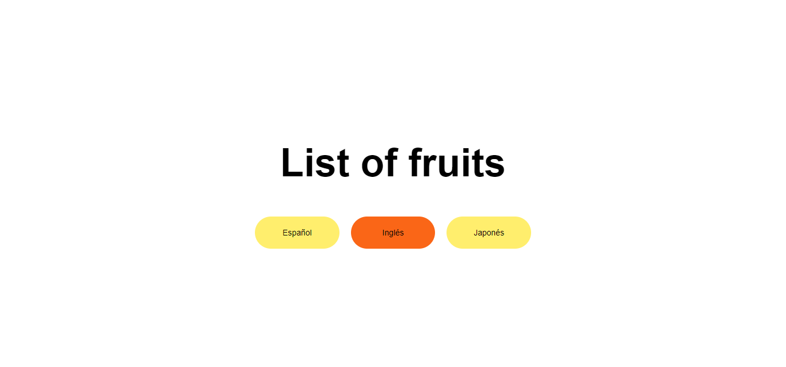

# Idiomas

Aplicaciones multilenguaje en Angular 7 con ngx-translate. Esta aplicación tiene como finalidad mostrar una demo para entender como funciona el cambio de idiomas, se mostrará un texto que cambiar'a según el idoma seleccionado.

## Vista Previa 



## Uso de ngx-translate

[ngx-translate](https://github.com/ngx-translate/core) es una librería que permite manejar los distintios idiomas a los que se quieran dar soporte.
Para instalarla ejecute el siguiente comando:
```bash
npm install @ngx-translate/core @ngx-translate/http-loader --save
```

## Modificando app.module.ts

Es necesario agregar ngx-translate en el archivo app.module.ts. de la siguunete forma:

```typescript
import { BrowserModule } from '@angular/platform-browser';
import { NgModule } from '@angular/core';
//Translation
import { TranslateLoader, TranslateModule } from '@ngx-translate/core';
import { TranslateHttpLoader } from '@ngx-translate/http-loader';
import { HttpClient, HttpClientModule } from '@angular/common/http';
import { AppRoutingModule } from './app-routing.module';
import { AppComponent } from './app.component';
@NgModule({
  declarations: [
    AppComponent
  ],
  imports: [
    BrowserModule,
    AppRoutingModule,
    HttpClientModule,
    TranslateModule.forRoot({
      loader: {
        provide: TranslateLoader,
        useFactory: (http: HttpClient) => {
          return new TranslateHttpLoader(http);
        },
        deps: [ HttpClient ]
      }
    })
  ],
  providers: [],
  bootstrap: [AppComponent]
})
export class AppModule { }
```

* **Imports de TranslateLoader, TranslateModule y TranslateHttpLoader:** Corresponden a las módulos y providers necesarios para que ngx-translate funcione correctamente.

* **Configuración de TranslateModule:** Se debe utilizar un loader personalizado para este módulo. TranslateHttpLoader cargará archivos de idioma bajo demanda utilizando HttpClient.

## Archivos de idioma

Dentro de la carpeta assets del proyecto, se crea una carpeta i18n y un archivo JSON por cada idioma al que se le dará soporte:
* src/assets/i18n/en.json
* src/assets/i18n/es.json
* src/assets/i18n/jp.json

En cada archivo se agrega la traducción del texto, en una propiedad de manera que en todos los archivos deberá estar la misma propiedad con la traduccion de la palabra.

**src/assets/i18n/es.json**

```json
{
  "principal.texto" : "Lista de frutas"
}
```

**src/assets/i18n/en.json**

```json
{
  "principal.texto" : "List of fruits"
}
```

**src/assets/i18n/jp.json**

```json
{
  "principal.texto" : "果物のリスト"
}
```

Para el manejo del idioma por defecto y los cambios del mismo se utiliza la siguiente sintaxis:

```typescript
public activeLang = 'es';

  constructor(
    private translate: TranslateService
  ) {
    this.translate.setDefaultLang(this.activeLang);
  }

  public cambiarLenguaje(lang: any) {
    this.activeLang = lang;
    this.translate.use(lang);
  }
```

Finalmete para hacer uso de los archivos que se acaban de crear se hace el llamado a la propiedad con la directiva translate
```html
  <h1>{{ 'principal.texto' | translate }}</h1>
```
